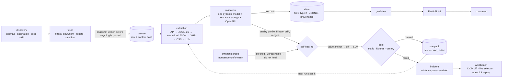

# Kintsugi — web data that repairs itself, and tells you when it can't

> Scraper → cleaning → versioned store → API. When a source changes its layout, the extractor is
> repaired automatically — but only after the fix has been proven against known-good pages. When it
> can't be proven, a human gets an incident with the evidence already assembled, not an alert to go
> investigate.

[](https://github.com/AlsoTheZv3n/kintsugi/actions/workflows/ci.yml)
[](LICENSE)
[](pyproject.toml)
[](compose.yaml)
[](#proving-the-healer)
[](#proving-the-healer)

> *Kintsugi* is the Japanese craft of mending broken pottery with gold — the repair is made visible
> rather than hidden. Every automatic fix here is a versioned, diffable, reversible row, and the
> repair history is part of the record.

## Why this exists

Writing a scraper takes an hour. Keeping twenty alive is the actual job, and the tooling splits badly:

- **Commercial platforms** (Bright Data Scraper Studio and similar) have the one thing you cannot
  self-host — a residential proxy network — and let an LLM rewrite generated Python when a site
  changes. Unbounded change surface, hard-to-review diffs, rollback means redeploying.
- **No-code scrapers** work until the first redesign, then silently return nothing.
- **Hand-rolled scripts** are fine at n=1 and unmaintainable at n=20, because nobody notices the
  breakage until a downstream consumer complains.

Kintsugi takes the opposite bet from the commercial tools: **the surface a model is allowed to change
is a schema-validated config row, not source code** — and no automatic change goes live without
passing a verification gate.

## What it does

- **One declarative site pack per source.** Discovery, fetch strategy, extraction, schema, quality
  thresholds and healing budget in one document. **Data, not code** — so a repair is a new row with a
  version number, rollback is a status update, and the blast radius of a bad proposal is one selector
  string.
- **Extraction tries the stable paths first.** Official API → JSON-LD → embedded JSON
  (`__NEXT_DATA__`, `__NUXT__`) → the site's own XHR endpoint → CSS selectors → LLM. **Most "scraping"
  is better done by finding the JSON the page already fetches for itself**; those endpoints outlive
  class names by orders of magnitude. The cheapest healing is the kind that never fires.
- **Breakage is detected by data quality, not by exceptions.** The expensive failure returns HTTP 200,
  parses cleanly, and has been writing `null` into a field for four days. The trigger is fill rate per
  field against a rolling median — not a stack trace.
- **Repair escalates by cost.** *Value anchor* (find last known-good value in the new DOM, derive a
  selector — deterministic and free, covers renamed classes, rotated hashes, inserted wrappers) →
  *DOM diff* against the last good snapshot → *LLM*, given only the changed subtree. **The model writes
  the extractor; it is never the extractor.** No model runs per page.
- **No fix ships unproven.** Static check → replay against 20–50 stored snapshots with known-correct
  expected values → canary on 5% of URLs → transactional promote → three runs of heightened watch with
  automatic rollback. Break the chain anywhere and it becomes an incident instead of a deployment.
- **Reachability is measured separately** by an independent probe. Without that split the system
  cannot tell *"source is down"* from *"our parser broke"* — and heals against a Cloudflare error page,
  destroying a working selector and committing the damage as the active version.
- **The API is read-only over a Slowly Changing Dimension Type 2 store.** Full change history per
  entity, a change feed that falls out for free, cursor pagination, ETag, and `extractor_version` in
  every payload so a consumer can ask which version produced a value.

**Deliberately not built, and it is not an oversight:**

- **No proxy network.** 400M residential IPs cannot be self-hosted. They can be bought and hidden
  behind an adapter — for the few sources that need them, not as a platform.
- **No arms race against enterprise bot protection.** Amazon, LinkedIn and friends teach you nothing
  about self-healing and everything about fingerprint rotation. Out of scope, stated rather than
  discovered.
- **No login-gated content, no protection bypass.** A CAPTCHA or consent wall aborts the run and opens
  an incident. Enforced in the fetcher, not just in [`COMPLIANCE.md`](COMPLIANCE.md).

### The five outcomes, and why they are the point

A run that didn't produce clean data can mean five different things, and collapsing them is how a
scraping platform starts lying to its operator:

| Outcome | Means | What happens |
|---|---|---|
| `ok` | Quality profile within thresholds | data lands, nothing else |
| `auto_healed` | Broke, repaired, gate passed, canary clean | new version active, logged, no alert |
| `escalated` | Broke, repair impossible or unproven | incident with evidence assembled, human paged |
| `blocked` | Consent wall, CAPTCHA, 429, soft-404 | **no healing attempted**, fetch problem reported |
| `degraded` | Partial outage, some pages empty | serves what it has, says so, no healing |

The bottom two rows are load-bearing. A healer that fires on a cookie banner learns selectors from the
banner and writes them in as the active version — worse than having no healer at all. Six such cases
are permanent negative tests in CI, and every incident a human closes as a false positive is added to
that set automatically. **The system gets better from its own mistakes without anything being
trained.**

## Proving the healer

The obvious plan — find sites that change often, test against them — does not work. A volatile site
breaks maybe every three weeks, in one variant, unannounced, with no control group. CI cannot wait for
that, and a single non-reproducible sample cannot drive development.

So real snapshots are mutated on purpose: 22 breakage scenarios, each with a declared expected
outcome, run on every commit in seconds.

```bash
uv run pytest tests/mutations -v    # does the healer fix what it should, and leave alone what it shouldn't?
```

```
M01  class renamed .price_color → .price_color_v2      auto_healed   ✓
M02  hashed class rotated css-1a2b3c → css-9x8y7z      auto_healed   ✓
M03  wrapper div inserted, depth +1                    auto_healed   ✓
…
M13  field removed entirely                            escalated     ✓   schema decision, not a repair
M15  natural key no longer extractable                 escalated     ✓   corrupts the store retroactively
N01  consent wall returned with HTTP 200               no_action     ✓
N03  A/B test, same content, different order           no_action     ✓
N04  429 from the rate limiter                         no_action     ✓

healed      11/12    escalated  4/4    false positives  0/6
```

**The false-positive number is the one that matters.** 90% healing at 20% false positives is a worse
system than 70% at zero, because a false positive destroys a working extractor and commits the damage.

Real sites still get used — but for a different question. They test whether the mutation catalog
resembles reality, and they test the fetch layer, which cannot be simulated. Sources that expose the
same data through both HTML and an official API are the strongest test available: the API is free
ground truth, so the extractor is checked against it nightly without anyone maintaining an expected
result. The full test-target strategy and mutation catalog live in the project's internal design
notes, which are not published in this repository.

**What the verification gate does not do, and it is the bigger half.** The gate proves a proposal
reproduces known-correct values on stored pages. It does not prove the proposal is *right* — only that
it is *consistent with what was already seen*. The failure it cannot catch: a selector that after a
redesign grabs the crossed-out list price instead of the sale price. Valid type, sane range, 99% fill
rate, passes every check, and is wrong on every row. Range bounds and distribution drift catch the
gross version; a plausible one goes through. Catching it properly needs cross-source corroboration —
comparing the same fact from an independent source — which is real work, not done, and stated here
rather than left for you to find in production.

## Quickstart

### Available now

Phase 0 is a walking skeleton: one command fetches a sandbox source and writes validated,
provenance-complete rows to PostgreSQL. That is all it does, and every command below runs against a
cold clone.

```bash
git clone https://github.com/AlsoTheZv3n/Kintsugi.git
cd Kintsugi
uv sync
docker compose up -d postgres          # single PostgreSQL 16 service, see compose.yaml
uv run alembic upgrade head
uv run kintsugi pack sync books.toscrape.com book --activate
uv run kintsugi run books.toscrape.com
```

`books.toscrape.com` is the source because it explicitly permits scraping and its pagination yields
1000 products, so the ≥200-record definition of done is reachable from a cold clone. A second `run`
writes no duplicates.

There is no host-installed `psql` client and none is needed: run ad-hoc SQL through the container,
`docker compose exec -T postgres psql -U kintsugi -d kintsugi -c 'select 1'`. If port 5432 is already
taken — this machine also runs XAMPP — set a single knob and everything follows it:
`KINTSUGI_PG_PORT=55432 docker compose up -d postgres`; the application composes its `database_url`
from the same variable.

### Planned

Nothing below exists yet; each line is tagged with the phase that ships it, so the README dates its
promises instead of faking them.

```bash
uv run kintsugi sources                 # status, last run, active version        (Phase 3)
# GET /v1/book — read-only API over the gold layer                                 (Phase 3)
# Grafana fleet overview and healing scoreboard on :3000                           (Phase 3)
uv run kintsugi demo break --domain books.toscrape.com --field price              # (Phase 4)
# incident workbench: DOM diff, live selector, one-click fixture replay            (Phase 4)
```

The LLM proposal stage (Phase 4) is the only part that will want an API key — `ANTHROPIC_API_KEY` or a
local `OLLAMA_URL`. Without either, the healer stops after the value-anchor and DOM-diff stages and
escalates the rest: a degraded mode, not a broken one.

## Architecture



Two invariants carry the design. **The snapshot is written before parsing** — without it there are no
golden fixtures, no diff, and no reproducible breakage. **The probe is independent of the run** —
without it the healer cannot distinguish an outage from a bug, and the failure mode is silent and
destructive.

## A worked example

`books.toscrape.com` renames `.price_color` to `.price_color_v2`. Nothing throws. The run reports:

> **price · fill rate 0.03** — was 0.998 over the last 14 days
> *987 rows · 30 with a price · 0 range violations · probe reachable · not blocked*

The value anchor takes `£51.77` from yesterday's record for the same URL, finds it in exactly one text
node, and derives a selector — preferring `itemprop`, `data-*` and semantic tags over `nth-child` and
generated class names, because a selector built on a hashed class is a repair with a two-week shelf
life. Thirty stored snapshots replay: 30/30 exact on required fields, including the out-of-stock and
long-title edge cases that exist in the fixture set precisely so a lucky selector cannot pass. Canary
runs on 5% of URLs, distribution matches, version 4 is promoted in one transaction. No model was
called and nobody was woken up.

That is the project in miniature: the trigger was a metric rather than an exception, the repair was
deterministic rather than generated, and it shipped only because it reproduced values that were already
known to be right.

The honest caveat, since this section is about not overclaiming: the numbers above come from the
scripted demo scenario, not from a production fleet. The mutation harness measures the healer under
controlled breakage; it does not tell you how often real sources break in ways the catalog anticipated.
That number only exists after months of running, and it is not claimed here.

## Tech

Backend: Python 3.12 · FastAPI · PostgreSQL 16 · SQLAlchemy 2.0 Core + psycopg3 (synchronous) · uv ·
httpx · Playwright · selectolax (lexbor) · jsonpath-ng · Pydantic v2 · Polars + Pandera ·
ydata-profiling · tenacity · structlog. asyncpg is deferred to the Phase 3 API — Phase 0 and 1 are
deliberately synchronous.
Workbench (Phase 4): Next.js · TypeScript · Tailwind · shadcn/ui · CodeMirror 6.
Storage: filesystem bronze in Phase 0, SeaweedFS from Phase 5.
Ops: Prometheus · Grafana · Alertmanager · ntfy · Docker (multi-stage, non-root) · GitHub Actions.

The workbench is a Next.js application, built in Phase 4 as an authenticated internal tool for
triaging incidents. It is out of scope until the pipeline produces real incidents worth triaging, so
nothing of it exists yet.

The mutation suite runs against the real pipeline writing to a real database. It is written so that
disabling the healer makes it fail on the M-cases *and* pass on the N-cases, which is the only way to
know the test measures healing rather than absence of it.

## Compliance

robots.txt respected by default and not disablable without a documented site-pack entry. Terms of
service checked before a source is admitted, with the result recorded. Identifiable user agent with a
contact address. Conservative rate limits with conditional requests. No login-gated content, no
protection bypass. Personal data requires an explicit legal-basis entry and a working deletion path
before the source is activated — which for SCD Type 2 has to reach the historised rows and the bronze
snapshots too. See [`COMPLIANCE.md`](COMPLIANCE.md). Rules that live only in a document get broken; the
enforcement table lists where each one is implemented.

## Repo layout

| Path | What |
|---|---|
| `kintsugi/` | pipeline, site-pack model, healer, gate, API |
| `packs/` | site packs, one YAML per source and entity |
| `workbench/` | Next.js incident workbench (Phase 4) |
| `tests/mutations/` | the breakage catalog and its expected outcomes |
| `fixtures/` | golden snapshots with expected values, including edge cases |
| `compose.yaml` | local service stack; a single PostgreSQL 16 service in Phase 0 |
| `ops/` | Prometheus rules, Grafana dashboards, alert routing |

## Status

Phase 0 of six — the walking skeleton. Each phase has a checkable definition of done before the next
one starts; the phase plan is kept in the project's internal design notes and is not published here.
The two `target:` badges and the worked example describe the Phase 2 goal, not a measurement, and are
replaced with real numbers as that phase lands — a README that fakes its own results would be a
strange thing to ship on a project whose entire argument is verification before trust.
